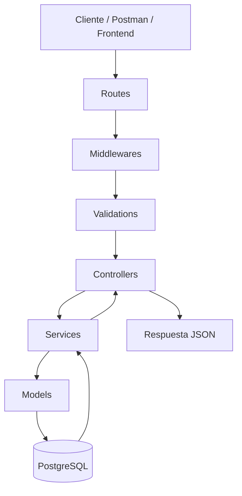
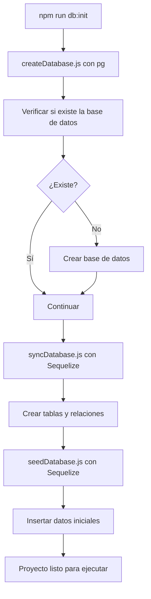
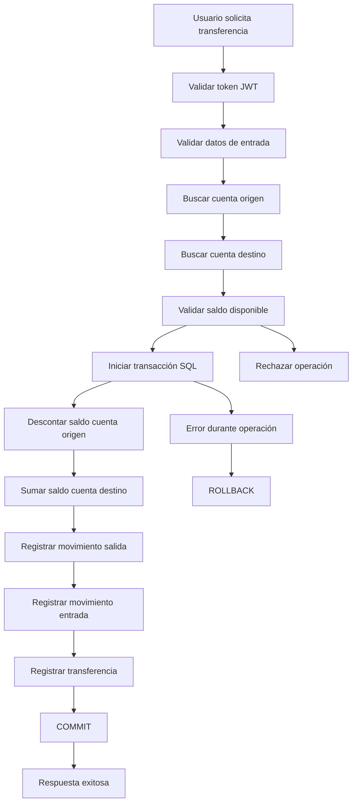
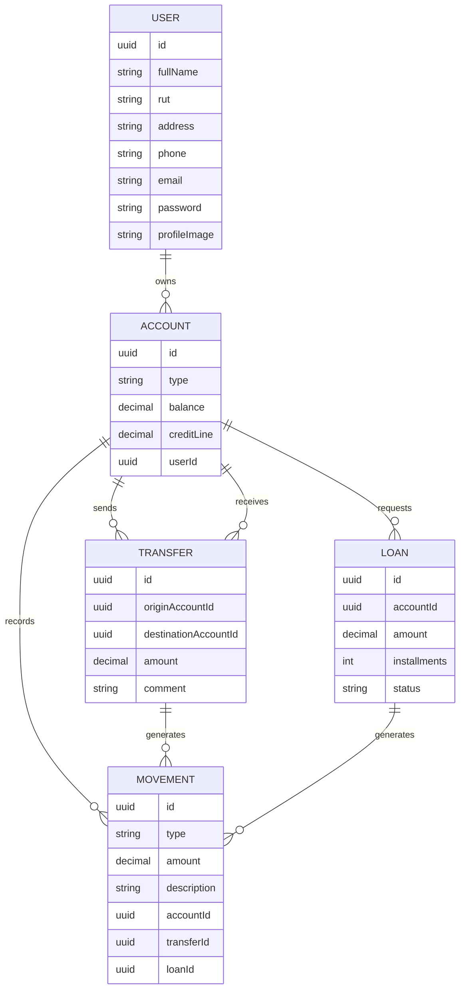

# NovaBank API

Proyecto integrador para construir una **API REST bancaria mínima pero profesional** con Express, Sequelize, PostgreSQL, JWT, validaciones, subida de archivos, UUID y transacciones SQL.

La idea de este proyecto no es construir un banco completo, sino desarrollar una base backend clara, segura y mantenible, que permita integrar los contenidos principales del módulo sin desbordar el alcance.

---

## Objetivo del proyecto

Construir una API que permita administrar operaciones bancarias esenciales.

El sistema permitirá:

- Registrar usuarios.
- Iniciar sesión con JWT.
- Consultar y actualizar datos del usuario autenticado.
- Subir imagen de perfil.
- Crear y consultar cuentas bancarias.
- Consultar saldos.
- Realizar transferencias entre cuentas.
- Registrar movimientos bancarios.
- Solicitar préstamos simples.
- Proteger rutas privadas mediante autenticación.
- Crear y preparar la base de datos desde scripts del proyecto.

Este proyecto integra contenidos de Node.js, Express, PostgreSQL, Sequelize, API REST, autenticación con JWT, validaciones, manejo de errores, subida de archivos, UUID, transacciones SQL y documentación técnica básica.

---

## Alcance del proyecto

Este proyecto se construirá como una **API bancaria mínima**.

Incluye obligatoriamente:

- Usuarios.
- Cuentas.
- Transferencias.
- Movimientos.
- Préstamos simples.
- Imagen de perfil.
- JWT.
- Subida de archivos.
- UUID.
- Validaciones.
- Transacciones SQL.
- Scripts de base de datos.
- README claro.

No incluye:

- Recuperación de contraseña.
- Refresh tokens.
- Roles de administrador.
- Ejecución automática de transferencias programadas.
- Notificaciones por correo.
- Dashboard administrativo.
- Frontend completo.
- Cálculo real de intereses o cuotas bancarias complejas.

Estos puntos pueden quedar como mejoras futuras.

---

## Decisiones técnicas del proyecto

### 1. Creación de base de datos

La base de datos se creará con un script usando `pg`.

```txt
scripts/createDatabase.js → usa pg
```

Motivo:

Sequelize necesita conectarse a una base de datos existente. Por eso primero se usa `pg` para conectarse a una base administrativa, normalmente `postgres`, verificar si la base existe y crearla si es necesario.

### 2. Creación de tablas y relaciones

Las tablas y relaciones se crearán con Sequelize.

```txt
scripts/syncDatabase.js → usa Sequelize
```

Motivo:

Sequelize es la herramienta que usaremos para definir modelos, tipos de datos, claves foráneas y relaciones.

### 3. Inserción de datos iniciales

Los datos iniciales se cargarán con Sequelize.

```txt
scripts/seedDatabase.js → usa Sequelize
```

Motivo:

El seed debe trabajar directamente con los modelos del proyecto para mantener coherencia con la estructura de la aplicación.

### 4. Inicialización completa

El flujo completo se orquestará con:

```txt
scripts/initDatabase.js
```

Este archivo debe ejecutar:

```txt
1. createDatabase.js
2. syncDatabase.js
3. seedDatabase.js
```

---

## Versiones recomendadas

| Herramienta | Versión recomendada | Uso |
|---|---:|---|
| Node.js | 24 LTS o superior | Entorno de ejecución JavaScript. |
| PostgreSQL | 18.x recomendado | Base de datos relacional. |
| Express | 5.2.1 | Framework para construir la API. |
| Sequelize | 6.37.7 | ORM para modelos y relaciones. |
| pg | 8.16.3 | Driver de PostgreSQL para Node.js. |
| dotenv | 17.2.3 | Manejo de variables de entorno. |
| jsonwebtoken | 9.0.2 | Generación y validación de JWT. |
| bcrypt | 6.0.0 | Hash de contraseñas. |
| express-fileupload | 1.5.2 | Subida de archivos al servidor. |
| cors | 2.8.5 | Permitir peticiones desde otros orígenes. |
| nodemon | 3.1.11 | Reinicio automático del servidor en desarrollo. |

---

## Instalaciones del proyecto

Crear el proyecto:

```bash
npm init -y
```

Instalar dependencias principales:

```bash
npm install express@5.2.1 sequelize@6.37.7 pg@8.16.3 dotenv@17.2.3 jsonwebtoken@9.0.2 bcrypt@6.0.0 express-fileupload@1.5.2 cors@2.8.5
```

Instalar dependencia de desarrollo:

```bash
npm install --save-dev nodemon@3.1.11
```

En este proyecto **no instalaremos `body-parser`**, porque Express ya incluye `express.json()` y `express.urlencoded()`.

Tampoco es obligatorio instalar una librería externa para UUID, porque Sequelize permite usar `DataTypes.UUID` y `DataTypes.UUIDV4`.

---

## Scripts esperados en `package.json`

```json
{
  "type": "module",
  "scripts": {
    "dev": "nodemon server.js",
    "start": "node server.js",
    "db:create": "node scripts/createDatabase.js",
    "db:sync": "node scripts/syncDatabase.js",
    "db:seed": "node scripts/seedDatabase.js",
    "db:init": "node scripts/initDatabase.js"
  }
}
```

Flujo recomendado:

```bash
npm install
npm run db:init
npm run dev
```

---

## Variables de entorno

Crear un archivo `.env` tomando como referencia `.env.example`.

```env
PORT=3000

DB_NAME=novabank_db
DB_USER=postgres
DB_PASSWORD=tu_password
DB_HOST=localhost
DB_PORT=5432

JWT_SECRET=tu_clave_secreta
JWT_EXPIRES_IN=1h

INITIAL_BALANCE=100000
```

El archivo `.env` no debe subirse al repositorio.

---

## ¿Por qué trabajamos con esta estructura?

En proyectos pequeños es común escribir toda la lógica en un solo archivo. Eso puede funcionar al inicio, pero rápidamente se vuelve difícil de mantener, probar y corregir.

Por eso este proyecto separa responsabilidades:

- Las **rutas** definen los endpoints disponibles.
- Los **middlewares** validan o protegen antes de llegar al controlador.
- Las **validaciones** revisan que los datos recibidos sean correctos.
- Los **controladores** reciben la petición y devuelven la respuesta.
- Los **servicios** contienen la lógica principal del negocio.
- Los **modelos** representan las tablas y relaciones de la base de datos.
- Los **utils** guardan funciones reutilizables.
- Los **scripts** preparan la base de datos para que el proyecto pueda ejecutarse correctamente.

En un sistema bancario esta separación es especialmente importante, porque una operación como una transferencia no puede quedar a medias: debe completarse completamente o revertirse.

---

## Flujo general de una petición



---

## Flujo de inicialización de base de datos



---

## Flujo de una transferencia bancaria



---

## Estructura del proyecto

```txt
novabank-api/
│
├── src/
│   ├── config/
│   ├── models/
│   │   ├── User.js
│   │   ├── Account.js
│   │   ├── Transfer.js
│   │   ├── Movement.js
│   │   ├── Loan.js
│   │   └── index.js
│   │
│   ├── controllers/
│   ├── services/
│   ├── routes/
│   ├── middlewares/
│   ├── validations/
│   ├── utils/
│   ├── public/
│   │   └── uploads/
│   │       └── profiles/
│   └── app.js
│
├── scripts/
│   ├── createDatabase.js
│   ├── syncDatabase.js
│   ├── seedDatabase.js
│   └── initDatabase.js
│
├── server.js
├── package.json
├── .env.example
├── .gitignore
└── README.md
```

---

## Rol de cada directorio

| Directorio | Propósito |
|---|---|
| `src/config` | Configuración de variables de entorno y conexión a la base de datos. |
| `src/models` | Definición de modelos Sequelize y relaciones entre tablas. |
| `src/routes` | Definición de endpoints de la API. |
| `src/controllers` | Reciben la petición HTTP y coordinan la respuesta. |
| `src/services` | Contienen la lógica principal del negocio. Aquí viven procesos como transferencias, préstamos y movimientos. |
| `src/middlewares` | Funciones que se ejecutan antes del controller, como validar JWT, validar archivos o manejar errores. |
| `src/validations` | Validaciones de datos recibidos desde el cliente. |
| `src/utils` | Funciones reutilizables, como respuestas estándar, manejo de archivos, JWT, contraseñas, UUID o errores. |
| `src/public` | Archivos estáticos visibles desde el navegador, incluyendo imágenes de perfil subidas. |
| `scripts` | Scripts para crear, sincronizar y poblar la base de datos. |

---

## Tablas esenciales

El proyecto trabajará con 5 tablas principales:

```txt
users
accounts
transfers
movements
loans
```

### `users`

Representa a la persona registrada.

Campos principales:

```txt
id UUID PK
fullName
rut
address
phone
email UNIQUE
password
profileImage
createdAt
updatedAt
```

### `accounts`

Representa una cuenta bancaria asociada a un usuario.

Campos principales:

```txt
id UUID PK
type
balance
creditLine
userId FK
createdAt
updatedAt
```

Tipos sugeridos:

```txt
corriente
ahorro
```

### `transfers`

Representa una transferencia entre cuentas.

Campos principales:

```txt
id UUID PK
originAccountId FK
destinationAccountId FK
amount
comment
createdAt
updatedAt
```

### `movements`

Representa el historial financiero de una cuenta.

Campos principales:

```txt
id UUID PK
type
amount
description
accountId FK
transferId FK opcional
loanId FK opcional
createdAt
updatedAt
```

Tipos sugeridos:

```txt
initial_balance
transfer_out
transfer_in
loan
```

### `loans`

Representa una solicitud simple de préstamo.

Campos principales:

```txt
id UUID PK
accountId FK
amount
installments
status
createdAt
updatedAt
```

Estado inicial sugerido:

```txt
approved
```

---

## Modelo general de datos



---

## UUID en el proyecto

En este proyecto usaremos **UUID** como identificador principal de los modelos.

En vez de exponer IDs predecibles como:

```txt
/api/v1/accounts/1
```

usaremos IDs con este formato:

```txt
/api/v1/accounts/7f9c2e9d-6d87-4b9f-9f2e-3b6487cfa901
```

Esto no reemplaza la seguridad con JWT, pero ayuda a evitar identificadores fáciles de adivinar.

---

## Rutas principales

Todas las rutas estarán versionadas bajo:

```txt
/api/v1
```

### Autenticación

```txt
POST   /api/v1/auth/register
POST   /api/v1/auth/login
```

### Usuario autenticado

```txt
GET    /api/v1/users/me
PUT    /api/v1/users/me
POST   /api/v1/users/me/profile-image
```

### Cuentas

```txt
GET    /api/v1/accounts
GET    /api/v1/accounts/:id
POST   /api/v1/accounts
```

### Transferencias

```txt
POST   /api/v1/transfers
GET    /api/v1/transfers
GET    /api/v1/transfers/:id
```

### Movimientos

```txt
GET    /api/v1/movements
GET    /api/v1/movements/:id
```

### Préstamos

```txt
POST   /api/v1/loans
GET    /api/v1/loans
```

---

## Autenticación con JWT

Al iniciar sesión, el servidor entrega un token.

Ese token debe enviarse en las rutas protegidas usando el header:

```txt
Authorization: Bearer TOKEN_AQUI
```

Las rutas privadas deben obtener el usuario autenticado desde el token, no desde datos enviados libremente por el cliente.

---

## Subida de imagen de perfil

El proyecto incluye subida de archivos usando `express-fileupload`.

Ruta obligatoria:

```txt
POST /api/v1/users/me/profile-image
```

Validaciones mínimas:

- El usuario debe estar autenticado.
- Debe venir un archivo en la petición.
- El archivo debe tener una extensión permitida.
- El archivo debe guardarse con un nombre único.
- El path del archivo debe actualizarse en el usuario.

Extensiones permitidas sugeridas:

```txt
.jpg
.jpeg
.png
.webp
```

---

## Transacciones SQL

Las transferencias deben ejecutarse dentro de una transacción.

Esto significa que todas las operaciones relacionadas deben completarse correctamente:

- Descontar saldo de la cuenta origen.
- Sumar saldo a la cuenta destino.
- Registrar movimiento de salida.
- Registrar movimiento de entrada.
- Registrar la transferencia.

Si una de estas operaciones falla, se revierte todo el proceso.

```txt
BEGIN
  actualizar cuenta origen
  actualizar cuenta destino
  crear movimientos
  crear transferencia
COMMIT
```

Si ocurre un error:

```txt
ROLLBACK
```

---

## Plan de trabajo sugerido en 5 días

| Día | Objetivo | Resultado esperado |
|---|---|---|
| Día 1 | Base del proyecto, configuración, servidor y scripts iniciales | Servidor levanta y base de datos puede crearse desde script. |
| Día 2 | Modelos, relaciones, sincronización y seed | Tablas con UUID, relaciones y datos iniciales. |
| Día 3 | Auth, JWT, utils, middlewares y validaciones base | Registro, login y rutas protegidas funcionando. |
| Día 4 | Cuentas, transferencias y movimientos | Transferencias con transacción SQL y movimientos registrados. |
| Día 5 | Préstamos, subida de imagen y cierre documental | Upload obligatorio, préstamos simples y README final. |

---

## Núcleo mínimo que debe quedar funcionando

Si el tiempo se ajusta, el proyecto debe asegurar como mínimo:

- Registro de usuario.
- Login con JWT.
- Rutas protegidas.
- Subida de imagen de perfil.
- Creación/listado de cuentas.
- Transferencia con transacción SQL.
- Registro de movimientos.
- Validaciones principales.
- README claro.

---

## Respuestas esperadas

Respuesta exitosa:

```json
{
  "ok": true,
  "message": "Operación realizada correctamente",
  "data": {}
}
```

Respuesta con error:

```json
{
  "ok": false,
  "message": "Error de validación",
  "errors": []
}
```

---

## Criterio de cierre del proyecto

El proyecto se considerará completo si:

- El servidor levanta sin errores.
- La base de datos se puede crear desde `npm run db:init`.
- Los modelos se sincronizan correctamente.
- El usuario puede registrarse e iniciar sesión.
- Las rutas protegidas requieren JWT.
- El usuario puede subir una imagen de perfil.
- El usuario puede crear o consultar cuentas.
- El usuario puede realizar una transferencia válida.
- La transferencia actualiza saldos y genera movimientos.
- Los errores principales están controlados.
- El README permite instalar y probar el proyecto.

---

## Buenas prácticas aplicadas

Este proyecto busca aplicar buenas prácticas como:

- Rutas REST versionadas.
- Uso correcto de métodos HTTP.
- UUID como identificador principal.
- Separación de responsabilidades por capas.
- Validaciones antes de ejecutar lógica de negocio.
- Contraseñas protegidas con hash.
- JWT para rutas privadas.
- Subida de archivos con validación.
- Variables sensibles fuera del código fuente.
- Transacciones SQL para operaciones críticas.
- Respuestas JSON consistentes.
- Manejo centralizado de errores.
- Scripts para preparar la base de datos.
- Documentación clara para instalar y probar el proyecto.

---

## Idea central

Una API bancaria no solo guarda datos.

También debe:

- validar la información recibida;
- proteger rutas sensibles;
- permitir subida de archivos controlada;
- asegurar que las operaciones críticas no queden incompletas;
- registrar movimientos;
- responder con mensajes claros;
- reutilizar funciones comunes;
- permitir levantar el proyecto fácilmente en otro computador.

Este proyecto busca servir como base de aprendizaje y también como referencia para futuros desarrollos backend.
