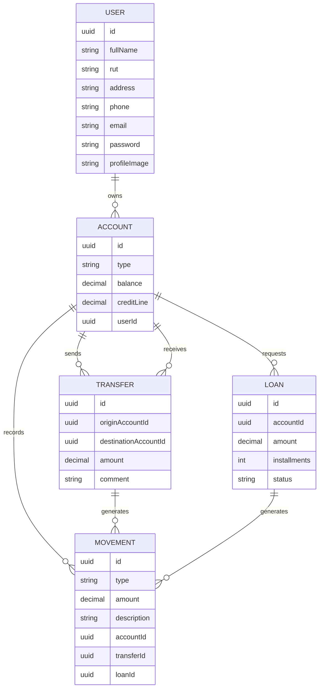

# Contexto del Proyecto: NovaBank API

## Evaluación integradora sugerida

**Módulo:** Implementación de API Backend Node Express  
**Nivel de dificultad:** Medio / Integrador  
**Modalidad sugerida:** Grupal o individual  
**Tecnologías principales:** Node.js, Express, PostgreSQL, Sequelize, JWT, express-fileupload

---

## Contexto del problema

NovaBank es una entidad financiera digital en etapa de modernización tecnológica. Actualmente, sus procesos básicos de registro de clientes, administración de cuentas, transferencias y solicitudes de préstamo se encuentran distribuidos en sistemas antiguos y poco integrados.

La organización necesita desarrollar una primera versión de una API REST que permita administrar operaciones bancarias esenciales de forma segura, ordenada y trazable.

Dado que el sistema manejará información sensible y movimientos de dinero, es fundamental aplicar buenas prácticas de arquitectura, validación de datos, autenticación con JWT, subida de archivos, manejo de errores, UUID y transacciones SQL.

El objetivo no es construir un banco completo, sino una base backend clara y funcional que permita comprender cómo se estructuran operaciones críticas en una API real.

---

## Alcance del proyecto

Este proyecto se construirá como una **API bancaria mínima pero profesional**.

Incluye obligatoriamente:

- Registro de usuarios.
- Inicio de sesión.
- JWT para rutas protegidas.
- Subida de imagen de perfil.
- Usuarios autenticados.
- Cuentas bancarias.
- Transferencias.
- Movimientos.
- Préstamos simples.
- UUID como identificador principal.
- Transacciones SQL en operaciones críticas.
- Validaciones separadas.
- Manejo centralizado de errores.
- Scripts para crear, sincronizar y poblar la base de datos.

No incluye:

- Recuperación de contraseña.
- Refresh tokens.
- Roles de administrador.
- Ejecución automática de transferencias programadas.
- Notificaciones por correo.
- Dashboard administrativo.
- Frontend completo.
- Cálculo real de intereses o cuotas bancarias complejas.

Estos puntos pueden quedar como mejoras futuras.

---

## Decisiones de alcance

Para evitar que el proyecto se vuelva demasiado grande para el tiempo disponible, se trabajará con 5 tablas esenciales:

```txt
users
accounts
transfers
movements
loans
```

Se priorizará que el proyecto quede funcional, claro y bien estructurado, antes que agregar demasiadas funcionalidades.

El núcleo mínimo esperado será:

- Registro.
- Login.
- JWT.
- Subida de imagen de perfil.
- Cuentas.
- Transferencias.
- Movimientos.
- Validaciones.
- Transacciones SQL.
- README.

---

## Decisiones técnicas

### Creación de la base de datos

La base de datos se creará mediante un script normal usando `pg`.

```txt
scripts/createDatabase.js
```

Este script debe conectarse a una base administrativa existente, normalmente `postgres`, verificar si la base de datos del proyecto existe y crearla en caso necesario.

### Sincronización de modelos

Las tablas y relaciones se crearán con Sequelize.

```txt
scripts/syncDatabase.js
```

Sequelize se usará para definir modelos, claves primarias UUID, relaciones y sincronización de tablas.

### Carga de datos iniciales

Los datos iniciales se insertarán con Sequelize.

```txt
scripts/seedDatabase.js
```

Esto permite trabajar directamente con los modelos definidos en la aplicación.

### Inicialización completa

El flujo completo se ejecutará desde:

```txt
scripts/initDatabase.js
```

Este archivo debe ejecutar ordenadamente:

```txt
1. createDatabase.js
2. syncDatabase.js
3. seedDatabase.js
```

---

## Condición técnica del proyecto

El proyecto debe estar preparado para que una persona pueda instalarlo, configurar las variables de entorno y dejar la base de datos lista desde scripts del propio proyecto.

Flujo esperado:

```bash
npm install
npm run db:init
npm run dev
```

El comando `npm run db:init` debe encargarse de:

1. Verificar si la base de datos existe.
2. Crear la base de datos si no existe.
3. Conectar a la base de datos del proyecto.
4. Sincronizar los modelos Sequelize.
5. Crear tablas y relaciones.
6. Insertar datos iniciales.
7. Dejar el proyecto listo para ser ejecutado.

---

## Versiones recomendadas

| Herramienta | Versión recomendada | Uso |
|---|---:|---|
| Node.js | 24 LTS o superior | Entorno de ejecución JavaScript. |
| PostgreSQL | 18.x recomendado | Base de datos relacional. |
| Express | 5.2.1 | Framework para construir la API. |
| Sequelize | 6.37.7 | ORM para modelos y relaciones. |
| pg | 8.16.3 | Driver de PostgreSQL para Node.js. |
| dotenv | 17.2.3 | Variables de entorno. |
| jsonwebtoken | 9.0.2 | Generación y validación de JWT. |
| bcrypt | 6.0.0 | Hash de contraseñas. |
| express-fileupload | 1.5.2 | Subida de archivos. |
| cors | 2.8.5 | Permitir peticiones desde otros orígenes. |
| nodemon | 3.1.11 | Desarrollo con reinicio automático. |

---

## Instalaciones requeridas

Instalar dependencias principales:

```bash
npm install express@5.2.1 sequelize@6.37.7 pg@8.16.3 dotenv@17.2.3 jsonwebtoken@9.0.2 bcrypt@6.0.0 express-fileupload@1.5.2 cors@2.8.5
```

Instalar dependencia de desarrollo:

```bash
npm install --save-dev nodemon@3.1.11
```

No se debe instalar `body-parser`, porque Express ya incluye `express.json()` y `express.urlencoded()`.

No es obligatorio instalar una librería externa para UUID. Sequelize permite crear claves primarias con `DataTypes.UUID` y `DataTypes.UUIDV4`.

---

## Objetivo general del proyecto

Desarrollar una API REST bancaria utilizando Express, Sequelize y PostgreSQL, que permita registrar usuarios, autenticar sesiones, administrar cuentas, realizar transferencias, registrar movimientos, solicitar préstamos simples y subir una imagen de perfil, aplicando buenas prácticas de seguridad, validación, transacciones SQL, UUID y arquitectura por capas.

---

## Objetivos específicos

El sistema deberá permitir:

- Registrar usuarios.
- Iniciar sesión mediante email y contraseña.
- Proteger rutas privadas usando JWT.
- Consultar y modificar los datos personales del usuario autenticado.
- Subir imagen de perfil.
- Crear cuentas bancarias asociadas a usuarios.
- Asignar saldo inicial a las cuentas.
- Administrar cuentas de tipo corriente y ahorro.
- Usar UUID como identificador principal de los modelos.
- Realizar transferencias entre cuentas.
- Validar saldo disponible antes de transferir.
- Registrar movimientos de entrada y salida.
- Solicitar préstamos simples.
- Usar transacciones SQL en operaciones críticas.
- Validar los datos recibidos antes de ejecutar lógica de negocio.
- Responder con códigos HTTP y mensajes JSON consistentes.
- Crear scripts que preparen la base de datos y carguen datos iniciales.

---

## Requerimientos funcionales

### 1. Registro de usuarios

El sistema debe permitir registrar usuarios con los siguientes datos:

- Nombre completo.
- RUT.
- Dirección.
- Teléfono.
- Email.
- Contraseña.

La contraseña debe almacenarse protegida mediante hash.

Al registrar un usuario, el sistema puede crear cuentas iniciales para facilitar las pruebas.

---

### 2. Inicio de sesión

El sistema debe permitir iniciar sesión con email y contraseña.

Si las credenciales son correctas, el servidor debe entregar un token JWT.

Ruta sugerida:

```txt
POST /api/v1/auth/login
```

Las rutas privadas deben recibir el token en el header:

```txt
Authorization: Bearer TOKEN_AQUI
```

---

### 3. Administración del perfil

El usuario autenticado debe poder consultar y modificar sus datos personales.

Rutas sugeridas:

```txt
GET /api/v1/users/me
PUT /api/v1/users/me
```

El usuario no debe enviar libremente su ID por body para modificar su información. El sistema debe obtener el usuario desde el token.

---

### 4. Subida de imagen de perfil

El usuario debe poder subir una imagen de perfil.

Ruta obligatoria:

```txt
POST /api/v1/users/me/profile-image
```

La subida debe validar:

- Que exista un archivo.
- Que el usuario esté autenticado.
- Que el archivo tenga una extensión permitida.
- Que el nombre final del archivo sea único.
- Que el path quede registrado en la base de datos.

Extensiones permitidas sugeridas:

```txt
.jpg
.jpeg
.png
.webp
```

---

### 5. Gestión de cuentas bancarias

Cada usuario puede tener una o más cuentas.

Tipos de cuenta sugeridos:

- Corriente.
- Ahorro.

Cada cuenta debe tener:

- UUID.
- Tipo.
- Saldo.
- Línea de crédito, si corresponde.
- Usuario asociado.

Rutas sugeridas:

```txt
GET  /api/v1/accounts
GET  /api/v1/accounts/:id
POST /api/v1/accounts
```

---

### 6. Transferencias

El sistema debe permitir transferir dinero desde una cuenta de origen hacia una cuenta de destino.

Ruta sugerida:

```txt
POST /api/v1/transfers
```

Datos mínimos esperados:

- ID de cuenta origen.
- ID de cuenta destino.
- Monto.
- Comentario opcional.

La transferencia debe validar:

- Que el usuario esté autenticado.
- Que los IDs tengan formato UUID válido.
- Que la cuenta origen exista.
- Que la cuenta origen pertenezca al usuario autenticado.
- Que la cuenta destino exista.
- Que el monto sea mayor que cero.
- Que exista saldo suficiente.
- Que la cuenta origen y destino no sean la misma.

La transferencia debe ejecutarse dentro de una transacción SQL.

---

### 7. Movimientos bancarios

Cada transferencia debe generar movimientos asociados.

Ejemplo:

- Movimiento de salida en la cuenta origen.
- Movimiento de entrada en la cuenta destino.

Rutas sugeridas:

```txt
GET /api/v1/movements
GET /api/v1/movements/:id
```

Cada movimiento debe tener:

- UUID.
- Tipo.
- Monto.
- Descripción.
- Fecha.
- Cuenta asociada.

Tipos sugeridos:

```txt
initial_balance
transfer_out
transfer_in
loan
```

---

### 8. Préstamos simples

El sistema debe permitir que un usuario solicite un préstamo asociado a una cuenta.

Ruta sugerida:

```txt
POST /api/v1/loans
```

Datos esperados:

- ID de cuenta.
- Monto solicitado.
- Cantidad de cuotas.

Para mantener el alcance controlado, el préstamo puede aprobarse automáticamente y sumar saldo a la cuenta.

Esta operación debe crear el préstamo y registrar el movimiento correspondiente.

---

## Requerimientos no funcionales

El proyecto debe cumplir con los siguientes criterios:

- Utilizar Express como framework principal.
- Utilizar PostgreSQL como base de datos relacional.
- Utilizar Sequelize como ORM.
- Utilizar JWT para proteger rutas privadas.
- Utilizar bcrypt para proteger contraseñas.
- Utilizar express-fileupload para subida de archivos.
- Utilizar UUID como clave primaria de los modelos principales.
- Utilizar variables de entorno para datos sensibles.
- Organizar el código por capas.
- Implementar validaciones separadas.
- Implementar funciones reutilizables en una carpeta `utils`.
- Implementar manejo centralizado de errores.
- Usar códigos HTTP adecuados.
- Usar transacciones SQL en operaciones críticas.
- Documentar el proyecto en un archivo README.

---

## Estructura mínima esperada

```txt
novabank-api/
│
├── src/
│   ├── config/
│   ├── models/
│   ├── controllers/
│   ├── services/
│   ├── routes/
│   ├── middlewares/
│   ├── validations/
│   ├── utils/
│   ├── public/
│   └── app.js
│
├── scripts/
│   ├── createDatabase.js
│   ├── syncDatabase.js
│   ├── seedDatabase.js
│   └── initDatabase.js
│
├── server.js
├── package.json
├── .env.example
├── .gitignore
└── README.md
```

---

## Modelo de datos sugerido



---

## Plan de trabajo sugerido en 5 días

| Día | Objetivo | Resultado esperado |
|---|---|---|
| Día 1 | Base del proyecto, configuración, servidor y scripts iniciales | Servidor levanta y base de datos puede crearse desde script. |
| Día 2 | Modelos, relaciones, sincronización y seed | Tablas con UUID, relaciones y datos iniciales. |
| Día 3 | Auth, JWT, utils, middlewares y validaciones base | Registro, login y rutas protegidas funcionando. |
| Día 4 | Cuentas, transferencias y movimientos | Transferencias con transacción SQL y movimientos registrados. |
| Día 5 | Préstamos, subida de imagen y cierre documental | Upload obligatorio, préstamos simples y README final. |

---

## Criterio de cierre

El proyecto se considera completo si:

- El servidor levanta sin errores.
- La base de datos se puede crear desde `npm run db:init`.
- Los modelos se sincronizan correctamente.
- El usuario puede registrarse e iniciar sesión.
- Las rutas protegidas requieren JWT.
- El usuario puede subir una imagen de perfil.
- El usuario puede crear o consultar cuentas.
- El usuario puede realizar una transferencia válida.
- La transferencia actualiza saldos y genera movimientos.
- Los errores principales están controlados.
- El README permite instalar y probar el proyecto.

---

## Criterios de evaluación sugeridos

| Criterio | Descripción |
|---|---|
| Funcionalidad | La API cumple los requerimientos principales. |
| Arquitectura | El proyecto está correctamente separado por capas. |
| Base de datos | Los modelos y relaciones están bien definidos. |
| Seguridad | Usa JWT y contraseñas protegidas con hash. |
| UUID | Los modelos principales usan UUID como identificador. |
| Validaciones | Los datos recibidos son validados antes de procesarse. |
| Transacciones | Las operaciones críticas usan transacciones SQL. |
| Movimientos | Las transferencias y préstamos generan registros trazables. |
| Upload | La subida de imagen de perfil funciona y actualiza la base de datos. |
| Buenas prácticas REST | Usa rutas, métodos y códigos HTTP adecuados. |
| Documentación | El README permite instalar y probar el proyecto. |
| Orden y claridad | El código es legible y mantenible. |

---

## Idea central del proyecto

NovaBank API busca que el estudiante comprenda que una API bancaria no se limita a crear registros.

Una operación crítica debe validar, ejecutar cambios relacionados, registrar trazabilidad y revertir todo si algo falla.

Este proyecto puede servir como base para comprender arquitectura backend, seguridad, UUID, subida de archivos, transacciones, relaciones y buenas prácticas REST con Express y Sequelize.
